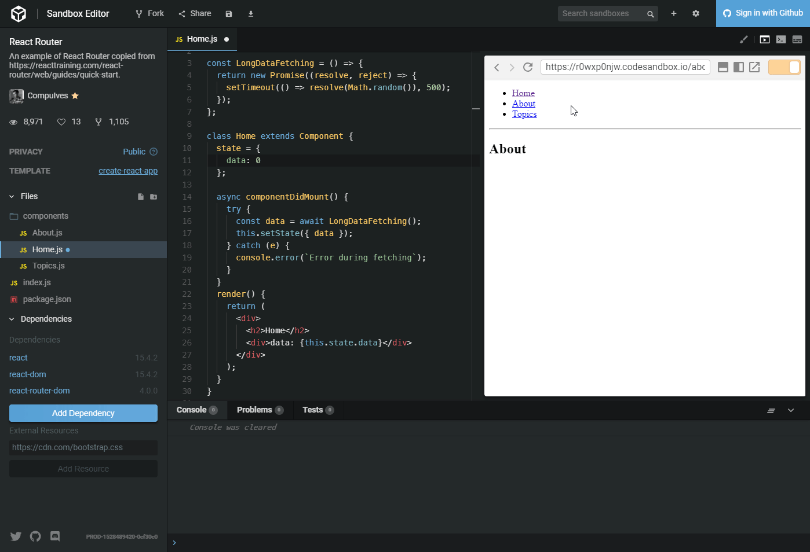

# Cancel Async
## What
This pattern describes use case where we want to avoid calling `setState()` after a component has unmounted. It happens usually when asynchronous action haven't finished before we destroy component eg. leaving a page.
 
## Example
Given we have 2 components representing pages. `Home` and `About`. Visiting `Home` page causes data to be fetched on the very begining. Normally we're hydrating component with data in `componentDidMount` method.

`📁 Home.jsx`
```js
import React, { Component } from "react";

const LongDataFetching = () => {
  return new Promise((resolve, reject) => {
    setTimeout(() => resolve(Math.random()), 500);
  });
};

class Home extends Component {
  state = {
    data: 0
  };

  async componentDidMount() {
    try {
      const data = await LongDataFetching();
      this.setState(data);
     } catch (e) {
      console.error(`Error during fetching`)
     }
  }
  render() {
    return (
      <div>
        <h2>Home</h2>
        <div>data: {this.state.data}</div>
      </div>
    );
  }
}

export default Home;
```

What will happen if fetching data takes long time and in the meanwhile we will change the view?


We get warning:

`Warning: setState(...): Can only update a mounted or mounting component. This usually means you called setState() on an unmounted component. This is a no-op. Please check the code for the Home component.`

## Patterns
### Mounted Flag
First solution is quite simple. It's described on official react doc page:
https://reactjs.org/blog/2015/12/16/ismounted-antipattern.html

`📁 Home.jsx`
```js
async componentDidMount() {
  this._mounted = true;
  try {
    const data = await LongDataFetching();
    this._mounted && this.setState({ data });
    const moreData = await AnotherLongDataFetching();
    this._mounted && this.setState({ moreData });
  } catch (e) {
    console.error(`Error during fetching`);
  }
}
componentWillUnmount() {
  this._mounted = false;
}
```

This is quite simple, but has also big drawback. Even we don't call `setState()` after unmounting, all async actions are being processed. We could put the second fetch into conditional clause but this way we end up with the code which will look like callback hell.


`📁 Home.jsx`
```js
async componentDidMount() {
  this._mounted = true;
  try {
    const data = await LongDataFetching();
    if (this._mounted) {
      this.setState({ data });
      const moreData = await AnotherLongDataFetching();
      if (this._mounted) {
        this.setState({ moreData });
        const thirdData = await AnotherLongDataFetching();
        this._mounted && this.setState({ thirdData });
      }
    }
  } catch (e) {
    console.error(`Error during fetching`);
  }
}
componentWillUnmount() {
  this._mounted = false;
}
```
### Cancel Token
Second solution is so called `Cancel Token`. The idea is to have a structure which will throw an exception if any action is performed after unmounting and thus to cancel functions which are not yet processed.

`📁 Home.jsx`
```js
  async componentDidMount() {
    try {
      await LongOperation();
      this.cancelToken.throwIfRequested();
      this.setState({ test: Math.random() });

      await LongOperation();
      this.cancelToken.throwIfRequested();
      this.setState({ test: Math.random() });

      await LongOperation();
      this.cancelToken.throwIfRequested();
      this.setState({ test: Math.random() });
    } catch (e) {
      if (e instanceof CancelError) {
        console.warn('Request cancelled');
      } else {
        console.error(`Fetch error: ${e}`);
      }
    }
  }
  componentWillUnmount() {
    this.cancelToken.cancel();
  }
  ```
  
  Implementation of `CancelToken` might look like this.

`📁 CancelToken.js`
```js
const createCancelToken = () => {
  let cancelled = false;
  return {
    cancel() {
      cancelled = true;
    },
    throwIfRequested() {
      if (cancelled) {
        console.log(cancelled);
        cancelled = false;
        throw new CancelError("Reqest cancelled.");
      }
    }
  };
};
```

**We achievied the followings:**
* Stop calling `setState` after component unmounts.
* Prevent all later async actions to be processed (transaction).

